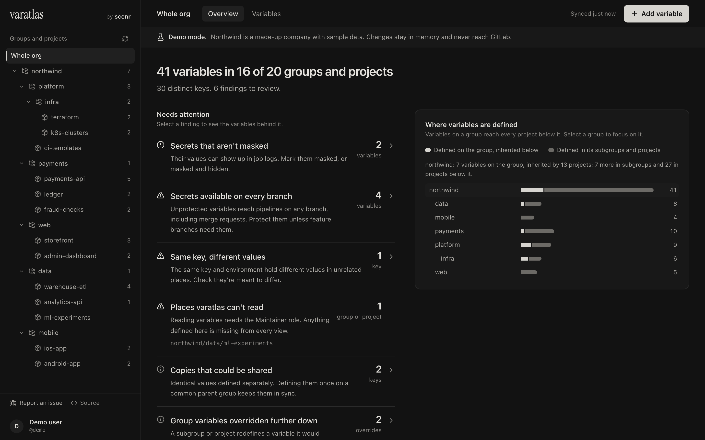
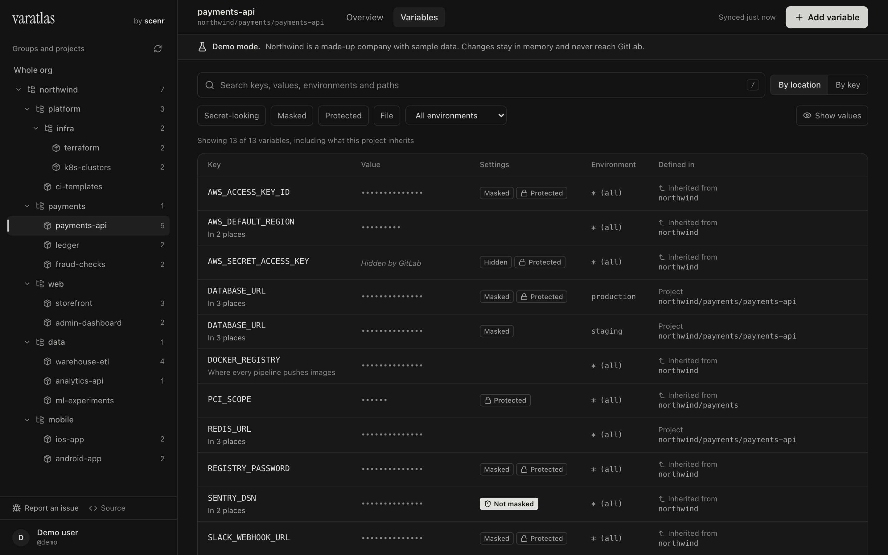
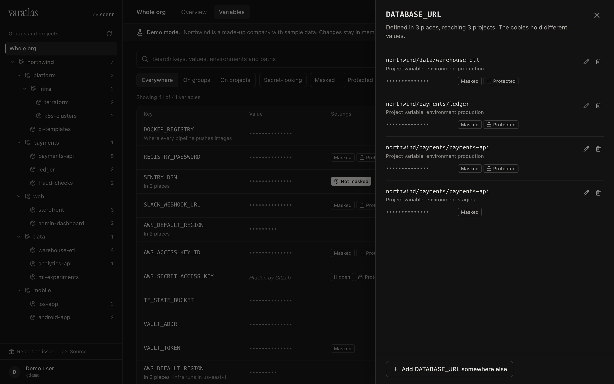
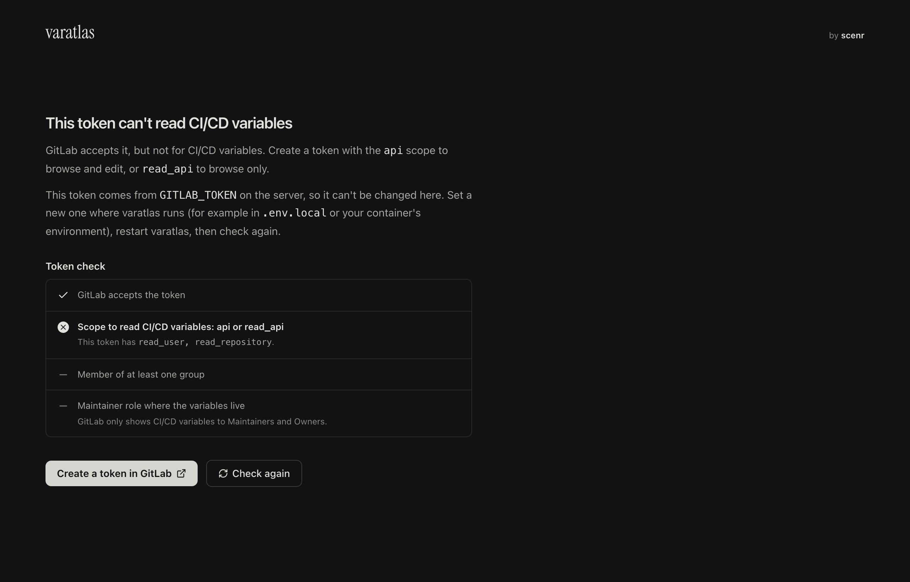

# varatlas

**Find, audit and manage every GitLab CI/CD variable across your whole org, in one place.**

GitLab shows CI/CD variables one project or group at a time. Once you have dozens of
groups and hundreds of projects, nobody can answer simple questions any more:

- Where is `AWS_SECRET_ACCESS_KEY` defined, and how many copies are there?
- Which secrets are not masked or not protected?
- What does `production` actually receive, and from which group?

varatlas points at a GitLab token, discovers every group, subgroup and project that
token can see, and maps every CI/CD variable: where it's defined, what each project
actually receives, and what needs fixing. You can also create, edit and delete
variables, with every GitLab field supported.

> Built and maintained by [scenr](https://github.com/scenr-io). Runs entirely on your
> machine; your token and variables never leave it except to talk to your GitLab.



## Try it without a token

Demo mode serves a made-up company with sample data, so you can explore everything
before connecting your GitLab:

```bash
docker run --rm -p 127.0.0.1:3131:3131 -e VARATLAS_DEMO=1 ghcr.io/scenr-io/varatlas
# → http://localhost:3131
```

Changes made in demo mode stay in memory and never reach GitLab.

## Features

**Needs attention.** Findings for secrets that aren't masked or protected, the same key
holding different values in unrelated projects, identical copies that could live on a
shared parent group, overridden group variables, and places your token can't read. Each
finding opens the variables behind it.

**The atlas.** Your group hierarchy as bars: how many variables are defined on each group
(and inherited by everything below) versus further down the tree.

**What a project receives.** Select a project to see its own variables plus everything it
inherits from parent groups, with replaced values marked.



**Track a key everywhere.** The by-key view and key detail show every place a key is
defined, whether the copies agree, and how many projects each one reaches.



**Clear answers when a token can't do something.** varatlas checks the token's scopes,
expiry and role, and explains what's missing and how to fix it, instead of showing an
empty page. Read-only tokens get a read-only view.



**Also:**

- **Fast.** The org loads in a few GraphQL queries; reopening is instant from an
  in-memory snapshot that refreshes in the background. Selecting a group or project
  takes about 1 ms, even with 20,000 variables.
- **Search and filter** by key, value, path, environment, protection or masking.
  The table is virtualized, so thousands of variables scroll smoothly.
- **Safe by default.** Values stay masked until revealed, and masked-and-hidden values
  are never returned by GitLab.
- **Tiny.** About 31 KB in the browser, a single-file server, and a ~50 MB container.
- **Works with gitlab.com and self-managed GitLab.**

## Quick start

### Docker

```bash
docker run --rm -p 127.0.0.1:3131:3131 -e GITLAB_TOKEN=glpat-… ghcr.io/scenr-io/varatlas
# → http://localhost:3131
```

Images are published for amd64 and arm64. Pin a version (for example
`ghcr.io/scenr-io/varatlas:0.1.0`) for anything long-lived; see
[releases](https://github.com/scenr-io/varatlas/releases).

Or with Compose: download [`compose.yaml`](compose.yaml), then run
`GITLAB_TOKEN=glpat-… docker compose up -d`.

Always publish the port on `127.0.0.1` as shown (see [Security model](#security-model)).

### From source

Requires Node.js ≥ 22.12 and [pnpm](https://pnpm.io).

```bash
git clone https://github.com/scenr-io/varatlas.git
cd varatlas
pnpm install
pnpm build && pnpm start      # → http://localhost:3131
```

Paste a GitLab personal access token on the first screen, or set it once:

```bash
cp .env.example .env.local   # then set GITLAB_TOKEN=glpat-…
```

**Token scope:** `api` for read/write, `read_api` for read-only use (edits will fail
with 403). You need the **Maintainer** role on a group or project to read its
variables; anything you can't read is listed in a warning banner.

## Configuration

All settings are optional environment variables (or lines in `.env.local`).

| Variable                 | Default                   | Purpose                                                                                       |
| ------------------------ | ------------------------- | --------------------------------------------------------------------------------------------- |
| `GITLAB_TOKEN`           | (none)                    | Token to use. Skips the token screen and loads the org at startup.                            |
| `GITLAB_BASE_URL`        | `https://gitlab.com`      | Your GitLab instance.                                                                         |
| `VARATLAS_EXCLUDE_PATHS` | (none)                    | Comma-separated path segments to skip, e.g. `sandbox,archive`. Matches any segment of a path. |
| `VARATLAS_ALLOWED_HOSTS` | `localhost,127.0.0.1,::1` | Hostnames the API answers for. See [Security model](#security-model).                         |
| `VARATLAS_DEMO`          | (none)                    | Set to `1` to serve the built-in demo org instead of GitLab.                                  |
| `HOST`                   | `127.0.0.1`               | Listen address (`0.0.0.0` in the container image).                                            |
| `PORT`                   | `3131`                    | Listen port.                                                                                  |

## Security model

varatlas is a **single-user, local tool**. Read this before running it anywhere else.

- **There is no login.** Whoever can reach the server acts with the configured GitLab
  token and can read and change every variable it can see. The server listens on
  `127.0.0.1` by default; publish container ports on `127.0.0.1` only.
- **The token stays server-side.** It comes from `GITLAB_TOKEN` or an `httpOnly`,
  `SameSite=Strict` cookie and is only ever sent to your GitLab instance. Snapshots are
  kept in memory only, never written to disk.
- **Browser-based attacks are blocked.** API requests must carry an allowed `Host`
  header (stops DNS rebinding), and every state-changing request must be same-origin
  JSON (stops cross-site form posts). A strict Content-Security-Policy allows only
  same-origin scripts, and pages cannot be framed.
- **Hardened container.** Distroless image, no shell, runs as a non-root user, works with
  a read-only filesystem and all capabilities dropped (see `compose.yaml`).
- **Sharing it with a team?** Put it behind your own authenticating reverse proxy
  (SSO, VPN, etc.), then add that hostname to `VARATLAS_ALLOWED_HOSTS`. Never expose it
  directly.

Found a vulnerability? See [SECURITY.md](SECURITY.md).

## How it works

```
browser (Preact UI, ~30 KB) ──► Hono server (one bundled file)
                                 ├─ guards: host / origin / content-type
                                 ├─ snapshot cache (memory, per token)
                                 └─ GitLab: GraphQL for loading, REST for edits
```

- **Loading:** one REST call lists your groups, then a few paginated GraphQL queries per
  root group fetch every subgroup, project and variable. If GraphQL is unavailable (older
  self-managed GitLab), varatlas falls back to REST automatically.
- **Caching:** the server keeps the last snapshot in memory. Opening the UI shows it
  instantly and refreshes it in the background when it is older than 30 seconds. Edits
  update the snapshot in place.

```
src/
  server/          Hono app, run as dist/server/index.mjs
    gitlab/        GitLab client (REST + GraphQL, 429 retry), loaders, variable CRUD
    snapshot.ts    in-memory snapshot cache
    security.ts    request guards
    validation.ts  request-body validation (only known fields reach GitLab)
  shared/          types shared by server and browser
  web/             Preact + Tailwind UI, built by Vite into dist/public
```

For the full picture (request flow, caching, the token model, the web app and design
decisions) see [docs/architecture.md](docs/architecture.md).

**GitLab notes**

- "Masked and hidden" can only be set at creation (a GitLab rule).
- Group-level environment scopes require GitLab Premium; GitLab enforces this.

## Development

```bash
pnpm dev          # UI with hot reload + API server → http://localhost:3131
pnpm check        # lint + typecheck + tests
pnpm test:watch   # tests in watch mode
pnpm bench        # time the analysis on a synthetic 20,000-variable org
pnpm build        # production build → dist/
```

See [CONTRIBUTING.md](CONTRIBUTING.md).

## License

[MIT](LICENSE) © Scenr Technologies Private Limited
