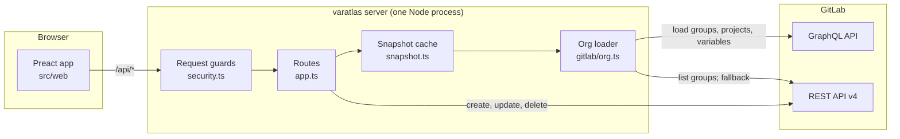
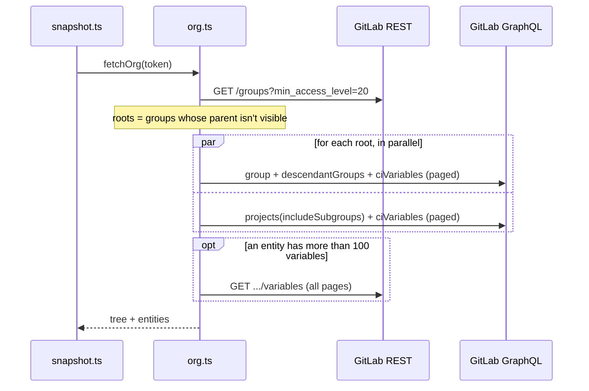
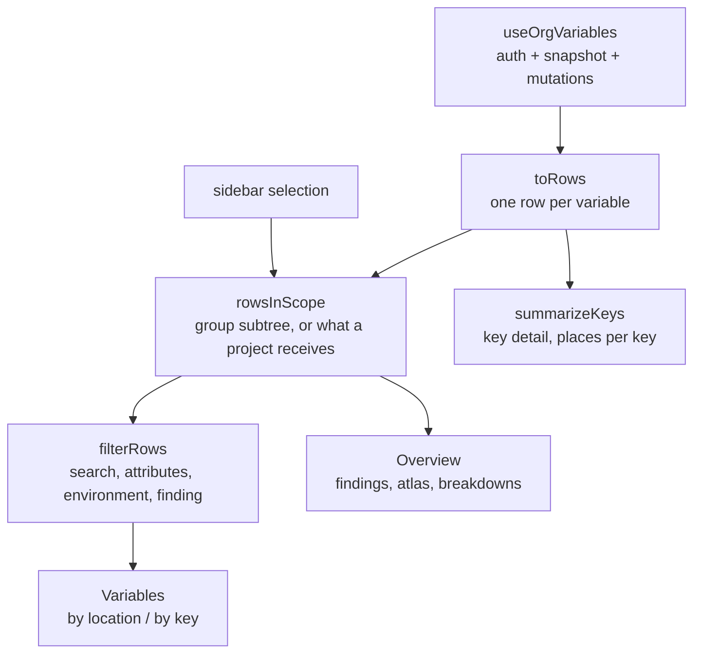

# varatlas architecture

varatlas shows every GitLab CI/CD variable in an org in one place: where each one is
defined, what each project actually receives, and what needs fixing. It is a single
process: a small TypeScript server that talks to GitLab and serves a Preact web app.

This document explains how the pieces fit together, why they are built this way, and
where to make changes.

## At a glance



- **Reads** go through GraphQL: a few paginated queries load the whole org.
- **Writes** go through REST, which supports every variable field.
- **The token never reaches the browser.** The server holds it, from `GITLAB_TOKEN` or an
  httpOnly cookie, and only ever sends it to GitLab.

## Repository layout

```
src/
  server/                 Node side; everything that touches the GitLab token
    index.ts              entry point: env loading, HTTP server, boot-time prewarm
    app.ts                Hono app: guards, routes, error mapping, static files
    auth.ts               token resolution (GITLAB_TOKEN, else cookie)
    security.ts           host / origin / content-type guards
    validation.ts         request-body parsing; only known fields reach GitLab
    snapshot.ts           in-memory snapshot cache per token
    backend.ts            where variables come from: GitLab, or the demo org
    demo.ts               the demo org (VARATLAS_DEMO=1)
    config.ts             environment settings
    http.ts               HttpError
    pooled.ts             bounded-concurrency map
    gitlab/
      client.ts           REST + GraphQL transport, pagination, 429 retry
      org.ts              load the org: GraphQL, falling back to REST
      graphql.ts          GraphQL loader
      discovery.ts        REST group/project discovery (fallback path)
      variables.ts        REST variable list and create/update/delete
      user.ts             current user, token scopes and expiry
  shared/
    types.ts              types shared by server and browser
  web/                    browser side; no secrets, no Node APIs
    main.tsx              entry point
    api.ts                typed client for /api
    hooks/                useOrgVariables (auth, snapshot, mutations), useAutoFocus
    rows.ts               flat row model and the filter bar's filtering
    insights.ts           findings, key summaries, inheritance, statistics
    access.ts             what the connected token can do
    secrets.ts            "looks like a secret" heuristic
    tree.ts               group tree for the sidebar
    virtual.ts            windowing math for the virtualized table
    components/           UI, grouped by feature (overview, variables, access, layout, ui)
    styles.css            design tokens (dark only)
scripts/
  dev.mjs                 runs the API server and Vite together
  build.mjs               bundles the server, precompresses the web assets
docs/
  architecture.md         this file
```

## Server

### Request handling

Every `/api/*` request passes `security.ts` before reaching a route:

| Check                                                          | Blocks                                                         |
| -------------------------------------------------------------- | -------------------------------------------------------------- |
| `Host` must be in `VARATLAS_ALLOWED_HOSTS` (default: loopback) | DNS rebinding, where a site points its own domain at 127.0.0.1 |
| State-changing requests need a same-origin `Origin` header     | Cross-site requests                                            |
| State-changing requests must be `application/json`             | Form and `text/plain` posts, which skip CORS preflight         |

`app.ts` also sets a strict Content-Security-Policy (same-origin scripts only), denies
framing, and compresses responses.

varatlas has no login of its own. Whoever can reach the server acts with its token, which
is why the server listens on `127.0.0.1` by default and the container should be published
on localhost only. See the README's security model.

### Routes

| Route                                    | Purpose                                                                      |
| ---------------------------------------- | ---------------------------------------------------------------------------- |
| `GET /api/auth`                          | Is a token configured, does GitLab accept it, what are its scopes and expiry |
| `POST /api/auth`                         | Check a pasted token and store it in the session cookie                      |
| `DELETE /api/auth`                       | Forget the session token                                                     |
| `GET /api/variables`                     | The cached snapshot; `?refresh=1` reloads from GitLab                        |
| `POST` / `PUT` / `DELETE /api/variables` | Create, update or delete one variable                                        |
| `GET /healthz`                           | Liveness check for containers                                                |

Request bodies are parsed by `validation.ts`, which drops unknown fields, so a request
can never pass extra parameters through to GitLab. Errors are `HttpError`s with a status
and a message meant for people. GitLab's 403s on writes are translated into
instructions: a missing `api` scope or a missing Maintainer role.

### Loading the org



- GraphQL returns `ciVariables: null` where the role is below Maintainer. That place is
  kept, marked "no access", and shown as a finding rather than failing the load.
- Archived projects and paths matching `VARATLAS_EXCLUDE_PATHS` are dropped.
- If GraphQL fails for a reason other than the token (for example an older self-managed
  GitLab without the `hidden` field), `org.ts` falls back to REST: discover groups and
  projects, then list variables per group or project, ten at a time.
- GraphQL and REST results were compared field by field on a real org (values included)
  and matched exactly.

`client.ts` retries 429 responses, honouring `Retry-After`, and follows REST pagination.

### Demo mode

With `VARATLAS_DEMO=1`, `index.ts` swaps the GitLab backend for `demo.ts`: a made-up
company served from memory, with no token and no network. The routes, guards, cache and
UI are the same code paths as with GitLab; only `backend.ts` and the snapshot loader
change. Its data triggers every finding at least once, which makes it the source of the
README screenshots, and a test keeps it that way. Changes are applied in memory and
vanish on restart; the UI shows a demo banner.

### Snapshot cache

`snapshot.ts` keeps the last loaded org per token, keyed by a SHA-256 of the token:

- **Memory only.** Secrets are never written to disk; a restart starts cold.
- **One load at a time.** Concurrent requests share an in-flight load.
- **Kept current by edits.** Create, update and delete patch the cached snapshot in place.
- **Warm early.** With `GITLAB_TOKEN` set, the snapshot loads at boot; a pasted token
  starts loading as soon as it is accepted.
- **Bounded.** At most eight tokens are cached.

The browser shows the cached snapshot immediately and asks for `?refresh=1` in the
background when it is older than 30 seconds.

### Token and access model

`GET /api/auth` calls GitLab's `/user` and `/personal_access_tokens/self` together and
classifies the result:

| Result                                                                                         | `AuthStatus`                                                  |
| ---------------------------------------------------------------------------------------------- | ------------------------------------------------------------- |
| `/user` succeeds and scopes include `api` or `read_api` (or scopes are unknown, as with OAuth) | `configured: true`, with `token.scopes` and `token.expiresAt` |
| `/user` returns 401                                                                            | `problem: "invalid"`; a refused cookie token is cleared       |
| `/user` returns 403, or scopes lack `api` and `read_api`                                       | `problem: "scope"`                                            |
| GitLab can't be reached                                                                        | `problem: "unreachable"`                                      |

Once data has loaded, `web/access.ts` adds what only the snapshot can tell: an account in
no groups, or a role below Maintainer everywhere. It also marks `read_api` tokens as
read-only and tokens within 14 days of expiry. Each state has its own screen or banner in
`components/access/`.

## Web app

### State and data flow



- **`useOrgVariables`** owns the auth status and the snapshot. Mutations call the API and
  then patch local state, so the UI updates without a reload.
- **`Dashboard`** holds the view state (selection, filters, open panels) and composes
  everything. The current view is kept in the URL hash.
- **Scope first, then filter.** `rowsInScope` turns the selection into rows: everything
  below a group, or a project's effective variables (its own plus inherited ones, with
  replaced values marked). The filter bar then narrows those rows.

### Derived data (`insights.ts`)

| Function                 | Used for                                                                                                                         |
| ------------------------ | -------------------------------------------------------------------------------------------------------------------------------- |
| `findFindings`           | Needs attention: unmasked or unprotected secrets, drift between unrelated places, shareable copies, overrides, unreadable places |
| `effectiveRows`          | What a project receives; nearer definitions win (project, then deeper groups)                                                    |
| `summarizeKeys`          | By-key view, key detail, "in N places"                                                                                           |
| `groupStats`             | The atlas: variables on each group versus below it                                                                               |
| `posture`, `scopeCounts` | Protection meters and environment breakdown                                                                                      |

These are pure functions with unit tests. Findings and atlas statistics are computed
once per snapshot for the whole org (drift and overrides need the full picture), and a
selection only narrows them.

### Rendering

- **Virtualized table.** Every row is exactly 56px, so `virtual.ts` computes which rows are
  on screen and the table renders only those, with spacer rows above and below.
- **Preact, not React.** Text fields use `onInput` (Preact's `onChange` fires on blur),
  and numeric inline styles carry explicit units because Preact 11 doesn't add `px`.
- **Design tokens** live in `styles.css` and the UI uses them by role (`fg`, `surface`,
  `series-1` and so on). The theme is dark only, with no hue: chart series differ by
  lightness, and severity is carried by icon shape and label, never by color alone.
  Every text color clears WCAG AA.

## Build and runtime

|         | Development                           | Production                                                                             |
| ------- | ------------------------------------- | -------------------------------------------------------------------------------------- |
| Command | `pnpm dev`                            | `pnpm build && pnpm start`                                                             |
| UI      | Vite on :3131 with hot reload         | `dist/public`, precompressed (brotli and gzip), fingerprinted assets cached for a year |
| API     | `tsx watch` on :3132, proxied by Vite | `dist/server/index.mjs`, one esbuild bundle with no `node_modules`                     |

The Vite proxy keeps the browser's `Host` header (`changeOrigin: false`) so the
same-origin guard behaves the same in development and production.

**Container.** A distroless Node image running as a non-root user, about 50 MB. It works
with a read-only filesystem and all capabilities dropped, listens on `0.0.0.0:3131`
inside the container, and has a health check on `/healthz`. See `Dockerfile` and
`compose.yaml`.

**CI.** Every push and pull request runs lint, typecheck, tests, dead-code detection and
the build, then builds the image and smoke-tests it. Pushing a `v*` tag publishes an
amd64 + arm64 image to GHCR.

## Testing

- **Server:** routes are exercised with `app.request()`; GitLab is replaced by stubbing
  `fetch`. Guards, validation, the auth classification, the GraphQL loader, pagination,
  retries and the cache each have their own tests.
- **Web:** the pure modules (`rows`, `insights`, `access`, `tree`, `virtual`) are unit
  tested.
- **Dead code:** `knip` runs as part of `pnpm check`.
- **Performance:** `pnpm bench` times the analysis on a synthetic 20,000-variable org.

`pnpm check` runs all of the above locally.

## Performance

Measured on a real org (18 groups, 31 projects, 60 variables):

|                        |                                                         |
| ---------------------- | ------------------------------------------------------- |
| First load from GitLab | about 2.8 s (one REST call, then a few GraphQL queries) |
| Reopening (cached)     | about 2 ms                                              |
| Browser download       | about 31 KB (brotli)                                    |
| Server bundle          | about 70 KB                                             |

**At scale.** `pnpm bench` times the analysis on a synthetic org with 500 groups,
3,000 projects and 20,000 variables:

|                                                                   |                      |
| ----------------------------------------------------------------- | -------------------- |
| Findings, atlas statistics and key summaries (once per data load) | about 25 ms in total |
| Selecting a group or project in the sidebar                       | about 1 ms           |
| A search keystroke                                                | about 3 ms           |

The org-wide results are computed once per snapshot and a selection only narrows them.
Each analysis is a single pass, indexed by key and by parent path, so the cost grows
with the number of variables rather than with its square.

## Design decisions

- **GraphQL for reads, REST for writes.** GraphQL loads the whole org in a handful of
  requests; REST is the complete, stable surface for variable changes, including
  `masked_and_hidden` and the `filter[environment_scope]` that tells same-key variables apart.
- **Memory-only cache.** Fast reopening without ever writing secrets to disk.
- **Local-first, no login.** varatlas is a single-user tool. It defends against browser
  attacks, and anything shared over a network must sit behind your own authenticating proxy.
- **Preact and Hono instead of Next.js.** About 31 KB in the browser instead of about
  194 KB, one process, and a server that bundles to a single file for a small container.
- **System fonts.** Nothing to download for text; one small serif for the wordmark.

## Making changes

- **Add a finding:** add it to `findFindings` in `web/insights.ts` with a test. If it is
  counted in keys rather than variables, add its id to `KEY_UNITS` in `Dashboard.tsx`.
  The overview and the finding filter pick it up automatically.
- **Add an API route:** add it in `server/app.ts`, parse its body in `validation.ts`, and
  test it with `app.request()`. The guards apply to everything under `/api`.
- **Talk to a new GitLab endpoint:** use `glJson`, `glPaginated` or `glGraphQL` from
  `server/gitlab/client.ts`, so retries and error messages behave the same everywhere.
- **Change the look:** edit the tokens in `web/styles.css` and keep components using roles,
  not raw colors. Check text contrast against the surface colors.
